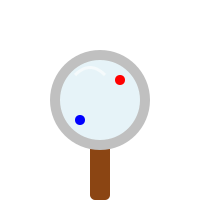

# Módulo 0: Antes de los Números

## Lección 0: ¡Bienvenidos a la Aventura Matemática!

¡Hola, explorador! 🌟

¿Estás listo para un viaje mágico? Hoy no necesitamos calculadora, ¡solo tus ojos y tu cerebro de detective! 🕵️‍♂️

En este curso vamos a descubrir que las matemáticas no son solo números en un papel... ¡son **TODO** lo que nos rodea!

### ¿Qué vamos a aprender?

1.  A mirar el mundo con "ojos matemáticos".
2.  A ordenar nuestras cosas (¡como tus juguetes!).
3.  A saber dónde estamos (¿arriba? ¿abajo?).

---

### 🎨 Actividad de Calentamiento

Mira a tu alrededor en tu habitación.

- ¿Ves algo que sea **REDONDO** como una pelota? 🔴
- ¿Ves algo que tenga **ESQUINAS** como una caja? 📦

¡Felicidades! Acabas de hacer tu primera observación matemática.

---

### 🎮 ¡Detective en Acción!

Encuentra las figuras escondidas en este juego:

<iframe src="../simulaciones/busqueda_visual.html" width="100%" height="500px" style="border:none;"></iframe>

---

> [!TIP] > **Para los papás:**
> Este módulo 0 es crucial para desarrollar el _pensamiento lógico_ antes de introducir la abstracción numérica. Ayude a su hijo a verbalizar lo que ve.
