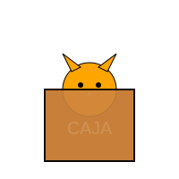

# Módulo 0: Antes de los Números

## Lección 1: ¿Dónde está el Gato? (Conceptos Espaciales)

¡Miau! 🐱 Nuestro amigo el Gato Matemático es muy travieso y le encanta esconderse. Para encontrarlo, necesitamos usar palabras especiales.

### ⬆️ Arriba y ⬇️ Abajo

Imagina un árbol gigante. 🌳

- Si el gato está en la rama más alta, está **ARRIBA**.
- Si el gato está en el suelo durmiendo, está **ABAJO**.

**¡Inténtalo tú!**

1.  Levanta tus manos muy alto. ¡Están **ARRIBA**!
2.  Toca tus zapatos. ¡Están **ABAJO**!

---

### ⬅️ Izquierda y ➡️ Derecha

Esto es un poco más difícil, ¡pero tú puedes!

- La mano con la que saludas a la bandera (o con la que escribes, si eres diestro) suele ser la **DERECHA**.
- ¡La otra es la **IZQUIERDA**!

**Juego del Robot** 🤖

1.  Da un paso a la **derecha**.
2.  Da un paso a la **izquierda**.
3.  ¡Salta hacia **arriba**!

---

### 🎮 Laberinto Espacial

Ayuda al cohete a llegar a la estrella usando las direcciones:

<iframe src="../simulaciones/laberinto_espacial.html" width="100%" height="450px" style="border:none;"></iframe>

### 📦 Dentro y Fuera

Imagina una caja de cartón.

- Si el gato se mete en la caja, está **DENTRO**.
- Si el gato salta al suelo, está **FUERA**.

### 🧠 Ejercicio Mental

Imagina un vaso de agua 🥛.

- ¿El agua está dentro o fuera del vaso?
- Exacto, ¡está **DENTRO**! Si estuviera fuera... ¡se mojaría la mesa! 💦

---

> [!NOTE] > **Palabras Clave:**
>
> - **Espacio**: El lugar donde están las cosas.
> - **Ubicación**: _Dónde_ está algo exactamente.
