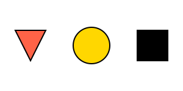

# Módulo 0: Antes de los Números

## Lección 2: El Orden de los Juguetes (Clasificación)

¿Alguna vez has tenido que ordenar tu cuarto? ¡Entonces ya sabes matemáticas! 🧸🚗

**Clasificar** significa poner cosas en grupos porque se parecen en algo.

### 🔴 🔵 Agrupar por Color

Imagina que tienes muchas pelotas.

- Unas son **ROJAS**.
- Otras son **AZULES**.

Si pones todas las rojas en una cesta y las azules en otra, ¡estás clasificando por color!

### 🔺 ⬜ Agrupar por Forma

Ahora mira estas galletas. 🍪

- Unas son redondas (círculos).
- Otras son cuadradas (cuadrados).

No importa si son de chocolate o de vainilla. Si pones los círculos juntos y los cuadrados juntos, ¡estás clasificando por forma!

### 🐘 🐜 Agrupar por Tamaño

Imagina un elefante y una hormiga.

- El elefante es **GRANDE**.
- La hormiga es **PEQUEÑA**.

Podemos hacer un grupo de "Animales Grandes" y otro de "Animales Pequeños".

---

### 🕵️‍♂️ Misión Secreta: ¡A Clasificar!

Busca en tu casa 5 objetos.

1.  Pon los grandes en la mesa.
2.  Pon los pequeños en la silla.

¿Qué acabas de hacer? ¡Clasificar por tamaño!

---

> [!IMPORTANT] > **¿Por qué aprendemos esto?**
> Clasificar nos ayuda a organizar nuestra mente. Antes de contar "cuántas manzanas hay", necesitamos saber "qué es una manzana" y separarla de las naranjas. 🍎🍊

---

## 🎮 Laboratorio Interactivo

¡Vamos a practicar! Arrastra las figuras a su lugar correcto en este juego mágico.

<iframe src="../simulaciones/juego_clasificacion.html" width="100%" height="500px" style="border:none;"></iframe>
