# Módulo 1: El Mundo de los Números (0-100)

## Lección 2: Bloques Mágicos (Valor Posicional)

¿Sabías que el lugar dónde se sienta un número es muy importante? 🪑

Imagina que **1** es un bloque pequeño. 🟦
Si juntamos **10 bloques pequeños**, formamos una **TORRE**. 🏢

### 🟦 Las Unidades (Los Sueltos)

Las unidades son los números solitos, del 0 al 9.
Son como bloques sueltos en el suelo.

### 🏢 Las Decenas (Las Torres)

Cuando tenemos 10 unidades, ¡pum! Se convierten en una **Decena**.
Una decena es un grupo de 10.

**Ejemplo con el número 13:**

- Tiene **1 Decena** (Una torre de 10). 🏢
- Y **3 Unidades** (Tres bloques sueltos). 🟦🟦🟦

**Ejemplo con el número 25:**

- Tiene **2 Decenas** (Dos torres). 🏢🏢
- Y **5 Unidades** (Cinco bloques sueltos). 🟦🟦🟦🟦🟦

---

### 🕵️‍♂️ Detective de Números

Mira el número **42**.

- ¿Cuántas torres (decenas) tiene? (Pista: es el primer número) -> **4**
- ¿Cuántos bloques sueltos (unidades) tiene? -> **2**

¡Así es! 42 significa 4 grupos de diez y 2 sueltos.

---

> [!IMPORTANT] > **Regla de Oro:**
> Siempre leemos los números de izquierda a derecha. Primero las decenas (las torres grandes) y luego las unidades (los pequeños).

---

## 🎮 Laboratorio de Bloques

¡Construye números con bloques!

- Usa **+10** para añadir una torre.
- Usa **+1** para añadir un bloque suelto.

<iframe src="../simulaciones/bloques_valor_posicional.html" width="100%" height="600px" style="border:none;"></iframe>
