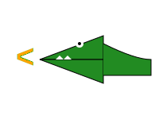

# Módulo 1: El Mundo de los Números (0-100)

## Lección 3: El Cocodrilo Hambriento (Mayor, Menor, Igual)

¡Cuidado! Hay un cocodrilo en el río. 🐊
Este cocodrilo es muy glotón y **siempre se come al número más GRANDE**.

### 🐊 Mayor que (>)

Imagina que tienes:

- **5** galletas 🍪🍪🍪🍪🍪
- **2** galletas 🍪🍪

¿Cuál se comerá el cocodrilo? ¡El 5!
Escribimos: `5 > 2` (La boca abierta del cocodrilo apunta al 5).

Se lee: _"5 es **mayor que** 2"_.

### 🐊 Menor que (<)

Ahora imagina:

- **3** manzanas 🍎🍎
- **8** manzanas 🍎🍎🍎🍎🍎🍎🍎🍎

El cocodrilo se comerá el 8.
Escribimos: `3 < 8` (La boca cerrada apunta al 3, la abierta al 8).

Se lee: _"3 es **menor que** 8"_.

### 🐊 Igual a (=)

¿Y si tenemos lo mismo?

- **4** pasteles 🧁🧁🧁🧁
- **4** pasteles 🧁🧁🧁🧁

El cocodrilo no sabe cuál comer... ¡así que abre la boca igual!
Escribimos: `4 = 4`

Se lee: _"4 es **igual a** 4"_.

---

### 🎮 ¡Alimenta al Cocodrilo!

Elige el plato con MÁS comida para el cocodrilo.

<iframe src="../simulaciones/alimenta_cocodrilo.html" width="100%" height="550px" style="border:none;"></iframe>

---

### 🎮 ¡A Jugar con el Cocodrilo!

Pon el signo correcto (`>`, `<`, `=`) en medio:

1.  10 \_\_\_ 5
2.  2 \_\_\_ 9
3.  7 \_\_\_ 7

_(Respuestas: >, <, =)_

---

> [!NOTE]
> Recuerda: La boca abierta **SIEMPRE** se come al más grande. ¡Ñam ñam! 😋
