# Módulo 2: Operaciones Mágicas (Sumas y Restas)

## Lección 1: La Magia de Juntar (Sumas Simples)

¡Abracadabra! ✨ Hoy vamos a hacer magia con los números.
La **SUMA** es cuando juntamos cosas para tener más. El símbolo mágico es `+`.

### 🍎 + 🍎 Juntando Manzanas

Imagina que tienes **2** manzanas rojas.
Tu amigo te regala **1** manzana verde.

¿Cuántas tienes ahora?
¡Contemos juntos! 1, 2... y 3.
`2 + 1 = 3`

### 🤖 La Máquina de Sumar

Imagina una caja con dos agujeros arriba.

1.  Metes **3** pelotas por el agujero izquierdo.
2.  Metes **2** pelotas por el agujero derecho.
3.  Todas caen juntas al fondo de la caja.

¿Cuántas pelotas hay en el fondo?
`3 + 2 = 5`

**¡Truco de Magia!** 🎩
Puedes sumar con tus dedos.

- Mano izquierda: 3 dedos.
- Mano derecha: 2 dedos.
- ¡Cuéntalos todos! ¡Cinco!

---

### 📝 Ejercicios Mágicos

Resuelve estas sumas (puedes dibujar palitos si te ayuda):

1.  4 + 1 = ?
2.  2 + 2 = ?
3.  5 + 0 = ? (¡El cero no vale nada, así que se queda igual!)

---

> [!NOTE]
> Sumar siempre nos da un número **MAYOR** (o igual, si sumamos cero). ¡Nunca tendrás menos cosas después de sumar!

---

## 🤖 Laboratorio de Sumas

¡Prueba la Máquina de Sumar!
Añade bolas rosas y verdes para ver cuántas hay en total.

<iframe src="../simulaciones/maquina_sumar.html" width="100%" height="600px" style="border:none;"></iframe>
