# Módulo 2: Operaciones Mágicas (Sumas y Restas)

## Lección 2: El Misterio de Quitar (Restas Simples)

A veces, las cosas desaparecen... ¡como por arte de magia! ✨
La **RESTA** es cuando quitamos cosas y nos quedan menos. El símbolo mágico es `-`.

### 🍪 - 😋 El Monstruo de las Galletas

Imagina que tienes **5** galletas recién horneadas.
Viene el Monstruo de las Galletas y se come **2**.

¿Cuántas te quedan?
Tenías 5. Quitas 2.
¡Te quedan **3**!
`5 - 2 = 3`

### 🎈 Globos que Explotan

Fui a una feria y compré **4** globos.
Pero... ¡PUM! Se explotó **1**.

¿Cuántos globos me quedan sanos?
`4 - 1 = 3`

---

### 🎮 Bolos de Resta

¡Derriba los bolos y mira cómo funciona la resta!

<iframe src="../simulaciones/bolos_resta.html" width="100%" height="520px" style="border:none;"></iframe>

**¡Truco de Dedos!** ✋

1.  Levanta 4 dedos (los globos que tenías).
2.  Baja 1 dedo (el globo que explotó).
3.  ¿Cuántos dedos quedan arriba? ¡Exacto, 3!

---

### 📝 Ejercicios de Misterio

Resuelve estas restas:

1.  3 - 1 = ?
2.  5 - 5 = ? (¡Si quito todo, no queda nada!)
3.  10 - 2 = ?

---

> [!IMPORTANT]
> Restar siempre nos da un número **MENOR** (o igual, si restamos cero). ¡Es imposible tener más galletas después de que el monstruo se las coma!
