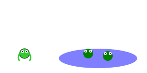

# Módulo 2: Operaciones Mágicas (Sumas y Restas)

## Lección 3: Cuentos Matemáticos (Problemas Verbales)

¡Ahora vamos a ser escritores de cuentos! 📖
Los números nos ayudan a contar historias.

### 🐸 Historia de las Ranas

En un estanque había **3** ranas tomando el sol. ☀️
Llegaron **2** ranas más para jugar. 🐸🐸
¿Cuántas ranas hay ahora en el estanque?

**Pensemos como detectives:** 🕵️‍♂️

- ¿Juntamos o quitamos? -> _Llegaron más_, así que **Juntamos (Suma)**.
- Operación: `3 + 2`
- Respuesta: **5 ranas**.

---

### 🐦 Historia de los Pájaros

En un árbol había **6** pájaros cantando. 🎶
De repente, **2** pájaros se fueron volando porque tenían hambre. 🦅🦅
¿Cuántos pájaros quedaron en el árbol?

**Pensemos como detectives:** 🕵️‍♂️

- ¿Juntamos o quitamos? -> _Se fueron_, así que **Quitamos (Resta)**.
- Operación: `6 - 2`
- Respuesta: **4 pájaros**.

---

### 🚀 ¡Tu turno de crear!

Inventa una historia para esta operación:

### 🎮 Creador de Cuentos

¡Inventa tu propia historia matemática aquí!

<iframe src="../simulaciones/creador_cuentos.html" width="100%" height="600px" style="border:none;"></iframe>
`4 + 3 = 7`

_Ejemplo: Tengo 4 coches rojos y mi papá me regala 3 azules..._

---

> [!TIP] > **Palabras Clave para Detectives:**
>
> - **Suma (+):** Llegaron, me dieron, compré, encontré, en total.
> - **Resta (-):** Se fueron, perdí, regalé, se comieron, quedaron.
