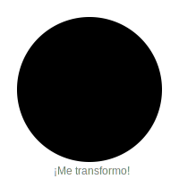

# Módulo 3: Formas y Medidas

## Lección 1: El País de las Formas (Geometría)

¡Bienvenidos al País de las Formas! Aquí todo tiene una figura especial. 📐

### 🟡 Figuras Planas (Como dibujos en papel)

1.  **Círculo:** Redondo como una moneda o el sol. ☀️ ¡No tiene esquinas!
2.  **Cuadrado:** Tiene 4 lados iguales. Como una caja o una ventana. 🪟
3.  **Triángulo:** Tiene 3 lados. ¡Como un trozo de pizza! 🍕
4.  **Rectángulo:** Es como un cuadrado estirado. Como una puerta. 🚪

### 📦 Figuras Sólidas (Gorditas, 3D)

Estas figuras no son planas, ¡ocupan espacio!

1.  **Esfera:** Como una pelota de fútbol. ⚽
2.  **Cubo:** Como un dado. 🎲
3.  **Cilindro:** Como una lata de refresco. 🥤
4.  **Cono:** ¡Como un gorro de fiesta o un helado! 🍦

---

### 🕵️‍♂️ Misión de Explorador

### 🎮 Constructor de Formas

¡Dibuja tus propias figuras geométricas!

<iframe src="../simulaciones/constructor_figuras.html" width="100%" height="550px" style="border:none;"></iframe>

Busca en tu casa:

- Algo que sea una **Esfera**. (Ej: Una naranja)
- Algo que sea un **Rectángulo**. (Ej: La televisión)
- Algo que sea un **Cilindro**. (Ej: Un vaso)

¡Dibújalos en tu cuaderno! 🎨

---

> [!TIP] > **Toque Mágico:**
> Toca las figuras. ¿Sientes las esquinas? Las esquinas se llaman **Vértices**.
>
> - ¿Cuántas esquinas tiene un triángulo? -> **3**
> - ¿Y un círculo? -> **0** (¡Es infinito!)
