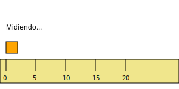

# Módulo 3: Formas y Medidas

## Lección 2: Midiendo el Mundo (Longitud)

¿Qué tan grande es un dinosaurio? ¿Qué tan pequeño es un ratón? 🦕🐁
Para saberlo, ¡necesitamos **MEDIR**!

### 👣 Medir con Pasos y Manos (No Estándar)

Hace mucho tiempo, la gente no tenía reglas. Usaban su cuerpo.

1.  **Cuartas:** Abre tu mano. Desde el dedo gordo hasta el meñique. 🤚
    - _Reto:_ ¿Cuántas "cuartas" mide tu mesa?
2.  **Pasos:** Camina poniendo un pie delante del otro. 👣
    - _Reto:_ ¿Cuántos pasos hay desde tu cama hasta la puerta?

**Problema:** Mi paso es pequeño, pero el paso de papá es GRANDE. ¡Nos salen números diferentes! 😲
Por eso necesitamos reglas especiales.

### 📏 La Regla Mágica (Estándar)

Para que todos midamos igual, usamos **Centímetros (cm)** y **Metros (m)**.

- **Centímetro (cm):** Es pequeñito, como el ancho de tu dedo. ☝️
  - Ideal para medir: Un lápiz, un insecto, un cuaderno.
- **Metro (m):** Es grande, como un paso gigante de papá.
  - Ideal para medir: Tu altura, una casa, un autobús. 🚌

---

### 📏 ¡A medir con Regla!

### 🎮 Regla Virtual

Mide el lápiz mágico usando la regla. ¡Ten cuidado de empezar en el 0!

<iframe src="../simulaciones/regla_virtual.html" width="100%" height="500px" style="border:none;"></iframe>

Busca una regla en tu casa.

1.  Mide tu lápiz. ¿Cuántos cm mide?
2.  Mide tu goma de borrar.
3.  ¿Cuál es más largo?

---

> [!NOTE]
> Recuerda poner el "0" de la regla justo donde empieza el objeto. Si empiezas en el 1... ¡el truco no funciona! 😉
