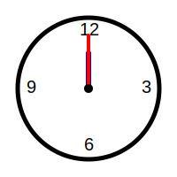

# Módulo 3: Formas y Medidas

## Lección 3: Viaje en el Tiempo (El Reloj)

Tick-tock, tick-tock... ⏰ ¿Qué hora es?
El reloj nos dice cuándo despertar, comer y jugar.

### 🌞 El Reloj de Agujas (Analógico)

Tiene dos manecillas mágicas:

1.  **La Pequeña (Horaria):** Es lenta y perezosa. Nos dice la **HORA**.
2.  **La Grande (Minutero):** Es rápida y larga. Nos dice los **MINUTOS**.

#### ¡Hora en Punto! (:00)

Cuando la grande señala al **12** (arriba del todo), es una hora "en punto".

- Pequeña en el 3, Grande en el 12 -> **3:00** (Las tres en punto).
- Pequeña en el 9, Grande en el 12 -> **9:00** (Las nueve en punto).

#### ¡Y Media! (:30)

Cuando la grande baja hasta el **6** (abajo del todo), ha pasado media hora.

- Pequeña pasadito el 2, Grande en el 6 -> **2:30** (Las dos y media).

---

### 📅 Los Días de la Semana

El tiempo también se mide en días. ¿Te sabes la canción?

1.  **Lunes** (Empezamos con energía 🔋)
2.  **Martes**
3.  **Miércoles**
4.  **Jueves**
5.  **Viernes** (¡Casi fin de semana! 🎉)
6.  **Sábado** (¡A jugar!)
7.  **Domingo** (Descanso 😴)

---

### 🧠 Reto del Tiempo

- Si entras al cole a las 8:00 y sales a las 10:00... ¿Cuántas horas pasaron?
- Contamos: 8... 9... 10.
- ¡Pasaron **2 horas**!

---

> [!IMPORTANT]
> El tiempo es oro, ¡pero aprender a leerlo es un superpoder! Practica mirando el reloj de la cocina cada vez que tengas hambre. 😋

---

## 🕰️ Reloj Mágico

¡Mueve las agujas del tiempo!
Juega añadiendo horas y minutos.

<iframe src="../simulaciones/reloj_interactivo.html" width="100%" height="550px" style="border:none;"></iframe>
