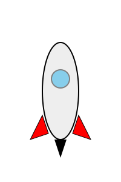

# Módulo 4: Números Grandes (hasta 1000)

## Lección 1: ¡Hasta el Infinito y Más Allá! (El 1000)

Ya eres un experto contando hasta 100. Pero... ¿qué hay después? 🚀

### 1️⃣0️⃣0️⃣ Después del 99...

  

Cuando llegamos al 99, ¡necesitamos un número más grande!
`99 + 1 = 100` (Cien)

Y después del 100, la aventura continúa:

- 101 (Ciento uno)
- 102 (Ciento dos)
- ...
- 199 ... ¡200! (Doscientos)

### 💯 Contando de 100 en 100

Vamos a dar saltos gigantes. Imagina que cada salto vale 100 puntos.

- **100** (Cien)
- **200** (Doscientos)
- **300** (Trescientos)
- **400** (Cuatrocientos)
- **500** (Quinientos) -> _¡Medio camino!_
- **600** (Seiscientos)
- **700** (Setecientos)
- **800** (Ochocientos)
- **900** (Novecientos)
- **1000** (¡MIL!) 🎉

¡Mil es un número enorme! Son muchas cosas.
Imagina **MIL** hormigas en fila. ¡Sería una fila muy larga! 🐜🐜🐜...

---

## 🚀 Explorador Espacial

¡Viaja por la tabla del 1000!
Usa los botones para ver los números del 100 al 200, al 300...

<iframe src="../simulaciones/tabla_1000.html" width="100%" height="600px" style="border:none;"></iframe>

---

### 🧠 Reto Mental

Si tienes 200 caramelos y te dan 100 más... ¿Cuántos tienes?

- 200 + 100 = **300** caramelos. 🍬

---

> [!TIP] > **El Secreto del Nombre:**
> Fíjate que los nombres se parecen a los números pequeños:
>
> - **Cuatro** -> **Cuatro**cientos
> - **Ocho** -> **Ocho**cientos
> - Pero cuidado con el 5 (**Quinientos**) y el 7 (**Setecientos**), ¡son un poco rebeldes! 😜
