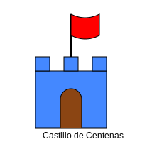

# Módulo 4: Números Grandes (hasta 1000)

## Lección 2: Castillos de Números (Las Centenas)

¿Te acuerdas de los bloques? 🟦

- **1** bloque = Unidad.
- **10** bloques = Decena (Torre). 🏢

Ahora, si juntamos **10 Torres**... ¡Construimos un **CASTILLO**! 🏰

### 🏰 La Centena (El Castillo)

Una Centena tiene:

- **100** Unidades (Bloques sueltos).
- o **10** Decenas (Torres de 10).

Se escribe con 3 cifras. Por ejemplo: **234**

### 🕵️‍♂️ Desarmando Números

Vamos a ver qué hay dentro del número **234**:

- **2 Centenas** (2 Castillos grandes) 🏰🏰 -> 200
- **3 Decenas** (3 Torres medianas) 🏢🏢🏢 -> 30
- **4 Unidades** (4 Bloques pequeñitos) 🟦🟦🟦🟦 -> 4

Se lee: _"Doscientos treinta y cuatro"_.

---

### 🎮 Constructor de Castillos

¡Construye tus propios castillos de centenas!

<iframe src="../simulaciones/constructor_castillo.html" width="100%" height="500px" style="border:none;"></iframe>

**Otro ejemplo: 508**

- **5 Centenas** 🏰🏰🏰🏰🏰
- **0 Decenas** (¡No hay torres hoy!) 🚫
- **8 Unidades** 🟦🟦🟦🟦🟦🟦🟦🟦

Se lee: _"Quinientos ocho"_. (¡Nos saltamos las decenas porque no hay!)

---

### ✍️ Escribe el Número

Yo te digo las partes, tú escribes el número:

1.  1 Centena, 5 Decenas, 2 Unidades. -> **¿?**
2.  3 Centenas, 0 Decenas, 9 Unidades. -> **¿?**
3.  9 Centenas, 9 Decenas, 9 Unidades. -> **¿?**

_(Respuestas: 152, 309, 999)_

---

> [!IMPORTANT] > **El Lugar Vale Oro:**
>
> - El **1** en 100 vale Cien.
> - El **1** en 10 vale Diez.
> - El **1** en 1 vale Uno.
>   ¡Donde pones el número lo cambia todo!
