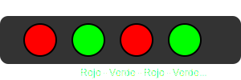

# Módulo 4: Números Grandes (hasta 1000)

## Lección 3: Patrones Secretos (Secuencias)

Los números a veces juegan al escondite siguiendo reglas secretas. 🤫
¡Vamos a descubrirlas!

### 🐰 Saltos de Conejo (+2)

Este conejo salta de 2 en 2.
`2, 4, 6, 8, 10...`

¿Cuál sigue?
Sí, el **12**.
Regla: _"Sumar 2"_.

### 🐸 Saltos de Rana (+5)

Esta rana salta de 5 en 5.
`5, 10, 15, 20, 25...`

¿Cuál sigue?
El **30**.
Regla: _"Sumar 5"_. (¡Fíjate que siempre terminan en 0 o 5!)

### 🚀 Despegue de Cohete (-1)

¡Cuenta atrás! Vamos hacia atrás.
`10, 9, 8, 7, 6...`

¿Cuál sigue?
El **5**.
Regla: _"Restar 1"_.

---

### 🕵️‍♂️ Misión: Rompe el Código

### 🎮 Secuencias Secretas

Descubre el número o color que falta:

<iframe src="../simulaciones/secuencia_patrones.html" width="100%" height="500px" style="border:none;"></iframe>

Descubre el número que falta:

1.  `100, 200, 300, ___, 500` -> (Pista: saltos de 100)
2.  `22, 24, 26, ___, 30` -> (Pista: saltos de 2)
3.  `50, 40, 30, ___, 10` -> (Pista: ¡vamos hacia atrás!)

_(Respuestas: 400, 28, 20)_

---

> [!TIP] > **Truco de Detective:**
> Para encontrar el patrón, mira dos números vecinos.
> ¿Suben o bajan? ¿Cuánto cambian? ¡Esa es la clave! 🔑
