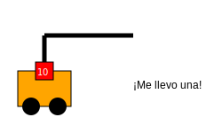

# Módulo 5: Desafíos Avanzados

## Lección 1: ¡Llevando Tesoros! (Suma con Reagrupación)

¿Recuerdas las Torres de Bloques? 🏢🟦

- Una Torre (Decena) = 10 Bloques (Unidades).

A veces, al sumar, ¡tenemos demasiados bloques sueltos!

### 🚨 El Problema del 10

Imagina que sumamos: `18 + 5`

1.  **Sumamos las Unidades:**

    - 8 bloques + 5 bloques = **13** bloques.
    - ¡Oh no! No podemos escribir 13 en el lugar de las unidades. ¡Solo cabe un número! 😱

2.  **La Magia del Canje:**

    - Cogemos **10 bloques** sueltos y los convertimos en **1 Torre** nueva.
    - Nos sobran **3** bloques sueltos.

3.  **Resultado:**
    - Los 3 sueltos se quedan en las Unidades.
    - La Torre nueva se va con las otras Decenas.
    - 1 Decena que teníamos + 1 nueva = **2 Decenas**.

**Total:** 2 Decenas y 3 Unidades = **23**.

### 📝 Pasos para Sumar Llevando

Hagamos `27 + 4`:

1.  **Suma unidades:** 7 + 4 = 11.
2.  **Canjea:** El 11 es "1 decena y 1 unidad".
3.  **Escribe:** El 1 (unidad) abajo. El 1 (decena) ¡vuela arriba a la columna de decenas!
4.  **Suma decenas:** 2 + 1 (que voló) = 3.
5.  **Resultado:** 31.

---

## 🏗️ Laboratorio de Construcción

¡Vamos a construir las decenas!
Usa el botón mágico para agrupar 10 unidades.

<iframe src="../simulaciones/suma_llevando_visual.html" width="100%" height="600px" style="border:none;"></iframe>

---

> [!TIP] > **Canción del Vuelo:**
> "Suma los pequeños, si te da más de diez... ¡manda el uno arriba y súmalo después!" 🎶
