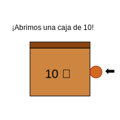

# Módulo 5: Desafíos Avanzados

## Lección 2: Pidiendo Ayuda (Resta con Reagrupación)

A veces queremos restar, pero... ¡no nos alcanza! 😮

### 🍪 Tengo Hambre...

Imagina que tienes **32** galletas (3 Cajas de diez y 2 sueltas).
Quieres comer **5**.

**El problema:**

- Tienes 2 sueltas.
- Quieres comer 5.
- ¡No puedes! A 2 no le puedes quitar 5.

### 🆘 Llamando al Vecino

1.  **Pedir Prestado:**

    - Las Unidades (2) tocan la puerta de las Decenas (3).
    - _"¡Vecino, vecino! ¿Me prestas una caja?"_

2.  **Romper la Caja:**

    - El vecino es muy amable. Te da 1 caja (1 decena).
    - Ahora el vecino se queda con **2** cajas.
    - Tú abres la caja y tienes 10 galletas nuevas + las 2 que tenías = **12** galletas.

3.  **¡A Comer!**
    - Ahora sí: **12 - 5 = 7**.
    - Y las decenas: **2 - 0 = 2**.

**Resultado:** 27.

---

### 🎮 Aprende a Pedir Prestado

Haz clic en las decenas para romperlas y obtener unidades.

<iframe src="../simulaciones/resta_prestando_visual.html" width="100%" height="550px" style="border:none;"></iframe>

---

### 📝 Pasos para Restar Prestando

Resta `41 - 9`:

1.  **Mira las unidades:** ¿A 1 le puedo quitar 9? ¡NO! 🚫
2.  **Pide prestado:** El 4 se convierte en 3. El 1 se convierte en 11.
3.  **Resta:** 11 - 9 = 2.
4.  **Baja las decenas:** Quedan 3.
5.  **Resultado:** 32.

---

> [!IMPORTANT] > **Recuerda:**
> Cuando pides prestado, el vecino **SIEMPRE** se hace más pequeño (pierde 1) y tú te haces más grande (ganas 10). ¡Es un trabajo en equipo! 🤝
