# Módulo 5: Desafíos Avanzados

## Lección 3: Sumas Repetidas (Intro a Multiplicación)

¡Felicidades! Has llegado al nivel de superhéroe. 🦸‍♂️
Vamos a aprender un truco para sumar MUY rápido.

### 🚴‍♂️ Bicicletas y Ruedas

Imagina que hay **3 bicicletas**.
Cada bicicleta tiene **2 ruedas**.
¿Cuántas ruedas hay en total?

Podemos sumar: `2 + 2 + 2 = 6`

### ✖️ El Truco de la "X"

En vez de escribir tantos números, los matemáticos usan un código secreto: la **Multiplicación**.

Decimos: _"3 veces 2"_
Escribimos: `3 x 2 = 6`

- El **3** significa "cuántos grupos hay" (bicicletas).
- El **2** significa "cuántos hay en cada grupo" (ruedas).

### 🐱 Patas de Gato

Hay **4 gatos**.
Cada gato tiene **4 patas**.
¿Cuántas patas hay?

- Suma lenta: `4 + 4 + 4 + 4 = 16` 😴
- Suma rápida (Multiplicación): `4 x 4 = 16` ⚡

---

- Suma rápida (Multiplicación): `4 x 4 = 16` ⚡

---

### 🎮 El Rectángulo Mágico

¡Crea rectángulos para multiplicar!

<iframe src="../simulaciones/matriz_multiplicacion.html" width="100%" height="550px" style="border:none;"></iframe>

### 🎨 Dibujando Grupos

Dibuja en tu cuaderno:

1.  **2 platos con 3 galletas cada uno.**

    - Suma: `3 + 3 = 6`
    - Multiplicación: `2 x 3 = 6`

2.  **5 manos con 5 dedos cada una.**
    - Suma: `5 + 5 + 5 + 5 + 5 = 25`
    - Multiplicación: `5 x 5 = 25`

---

> [!NOTE]
> ¡Acabas de empezar a multiplicar y ni te diste cuenta!
> Multiplicar es solo una forma perezosa (¡y genial!) de sumar lo mismo muchas veces. 😉
